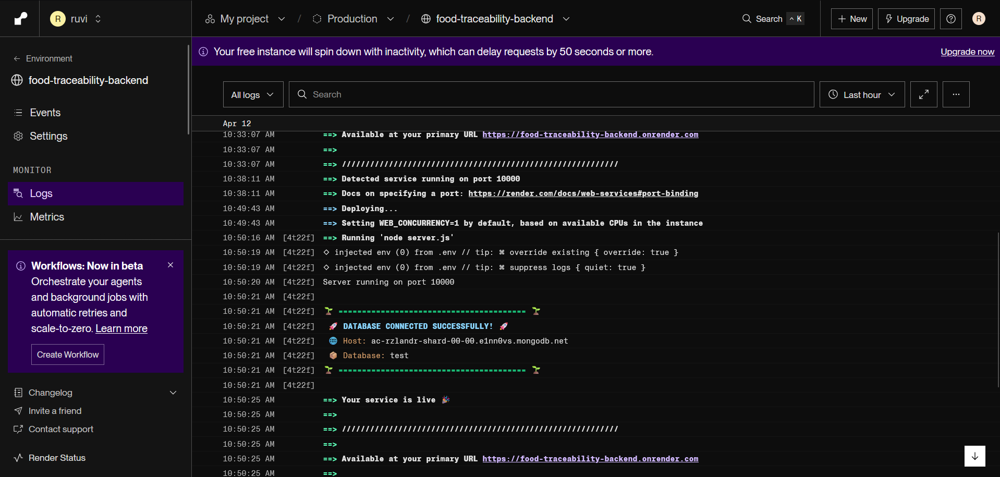
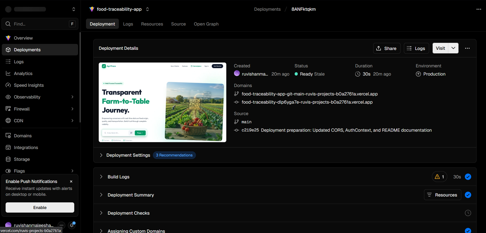

# 🌿 AgriTrace: Blockchain-Inspired Food Traceability System

[](https://github.com/wmrmweerakoon/food-traceability)
[](https://food-traceability-app.vercel.app)

AgriTrace is a high-fidelity food traceability platform designed to ensure transparency and accountability from farm to table. By digitizing every step of the supply chain, we empower consumers to verify the origin, quality, and journey of their food.

---

## 🌐 Live Application & Production Links

> [!IMPORTANT]
> **Production Environment:**
> *   **Frontend UI**: [https://food-traceability-app.vercel.app](https://food-traceability-app.vercel.app)
> *   **Backend API**: [https://food-traceability-backend.onrender.com](https://food-traceability-backend.onrender.com)
> *   **Database**: MongoDB Atlas (Cloud Cluster)

---

## 🛠️ Setup Instructions (Local Development)

### Prerequisites
- Node.js (v18+)
- MongoDB (Local or Atlas)
- Git

### Installation Steps
1. **Clone the Repo**:
   ```bash
   git clone https://github.com/wmrmweerakoon/food-traceability.git
   cd food-traceability
   ```
2. **Backend Configuration**:
   ```bash
   cd backend
   npm install
   # Create a .env file with:
   # PORT=5000
   # MONGODB_URI=your_mongodb_uri
   # JWT_SECRET=your_jwt_secret
   # FRONTEND_URL=http://localhost:5173
   npm run dev
   ```
3. **Frontend Configuration**:
   ```bash
   cd ../frontend
   npm install
   # Create a .env file with:
   # VITE_API_BASE_URL=http://localhost:5000
   npm run dev
   ```

---

## 📖 API Endpoint Documentation

All endpoints (except Auth) require a Bearer Token in the `Authorization` header.

### 🔐 Authentication
| Method | Endpoint | Description |
| :--- | :--- | :--- |
| POST | `/api/auth/register` | Register a new user (Farmer, Distributor, Retailer, Consumer) |
| POST | `/api/auth/login` | Login and receive a JWT token |

### 👨‍🌾 Farmer Service
| Method | Endpoint | Description |
| :--- | :--- | :--- |
| POST | `/api/farmer/batches` | Create a new product batch with harvest details |
| GET | `/api/farmer/batches` | Retrieve all batches created by the logged-in farmer |
| GET | `/api/farmer/batches/:id` | Get specific batch details including QR data |

### 🚛 Distributor Service
| Method | Endpoint | Description |
| :--- | :--- | :--- |
| GET | `/api/distributor/available-batches` | View batches ready for transport |
| POST | `/api/distributor/transport` | Start a new transport journey for a batch |
| PUT | `/api/distributor/transport/:id/update` | Update real-time coordinates of a shipment |

### 🏪 Retailer Service
| Method | Endpoint | Description |
| :--- | :--- | :--- |
| GET | `/api/retailer/inventory` | View store product stock |
| POST | `/api/retailer/process-sale` | Log a consumer sale and update inventory |
| GET | `/api/retailer/global-pricing` | Fetch live currency-converted price data |

### 🥗 Consumer Service (Public)
| Method | Endpoint | Description |
| :--- | :--- | :--- |
| GET | `/api/consumer/trace/:batchId` | Retrieve full farm-to-table journey report |
| POST | `/api/consumer/feedback` | Submit quality feedback for a product batch |

---

## 🚀 Deployment Report

### Infrastructure
- **Frontend**: Hosted on Vercel (Auto-deploy from `main` branch).
- **Backend**: Hosted on Render (Web Service) using Node.js 22 runtime.
- **Database**: MongoDB Atlas M0 (Free Tier) in AWS ap-east-1 region.

### Deployment Process
1.  **CI/CD**: Automatic builds triggered via GitHub Webhooks.
2.  **Security**: Environment variables (MONGODB_URI, JWT_SECRET) managed securely in platform dashboards.
3.  **CORS**: Configured on backend to only allow requests from the Vercel production domain.

### Deployment Evidence
| Render Backend | Vercel Frontend |
| :--- | :--- |
|  |  |

---

## 🧪 Testing Report

### Test Coverage Summary
- **Total Tests**: 43+ Automated Cases
- **Pass Rate**: 100%
- **Tooling**: Jest, Supertest

### Scope
1.  **Unit Tests**: Individual service logic (Pricing, Distance calculation, JWT validation).
2.  **Integration Tests**: End-to-end API flows (Register -> Create Batch -> View Trace).
3.  **Performance Tests**: Load-testing via **Artillery.io** simulating high concurrent traffic.

### Performance results
- **Median Latency**: <1s under load.
- **Stability**: 0% error rate during 100-user ramp-up tests.

---

## 🏗️ Technical Stack
- **Frontend**: React 19, Vite, Tailwind CSS, Leaflet Maps
- **Backend**: Node.js, Express.js, JWT, Bcrypt
- **Persistence**: MongoDB, Mongoose ODM

---

## 👥 Group Details
- **Group ID**: [Your Group ID]
- **Members**:
    - Member 1 (ID: XXXXXXXX)
    - Member 2 (ID: XXXXXXXX)
    - Member 3 (ID: XXXXXXXX)
    - Member 4 (ID: XXXXXXXX)

---
Developed for SLIIT Application Framework (AF) Module. 🌿
